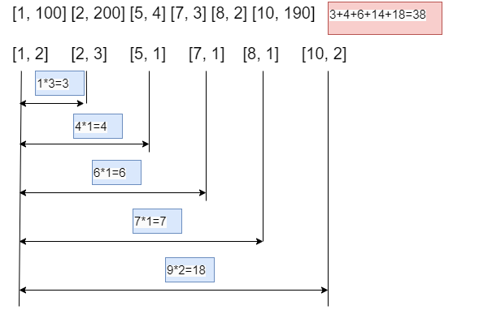
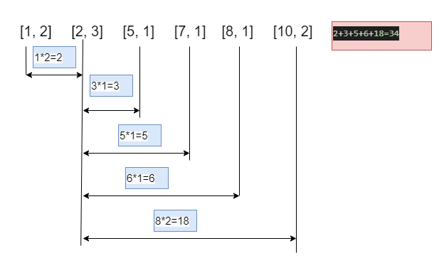
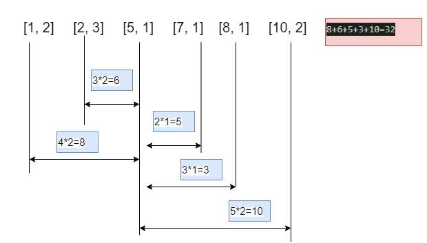
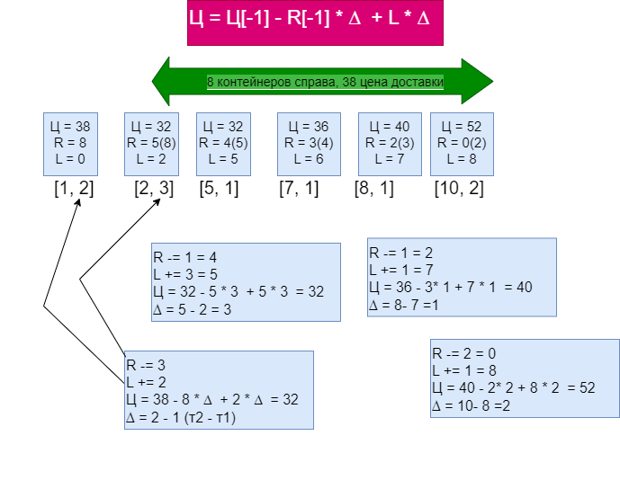

## Решение задачи

### Исходные данные 

```python
[пункт(км), пробирки]
```

В таком виде числа хранятся в файле

```python
[1, 100] [2, 200] [5, 4] [7, 3] [8, 2] [10, 190]
```

Преобразуем пробирки в контейнеры

```python
контейнер = ceil(пробирки / 96)
```

Результирующий список
```python
[1, 2] [2, 3] [5, 1] [7, 1] [8, 1] [10, 2]
```
### Анализируем стоимость доставки для пункта 1



### Анализируем стоимость доставки для пункта 2



### Анализируем стоимость доставки для пункта 3



и т.д.

Сначала посчитаем общую стоимость затрат для первого в списке пункта.


При в переменной r-sum посчитаем общее количество контейнеров пунктов справа, которые необходимо перевезти (аналогично, в переменной l-sum будем считать общее количество контейнеров пунктов слева)


Формула для расчета стоимости доставки для текущей точки
```
Ц = Ц[-1] - R[-1] * ∆  + L * ∆
```