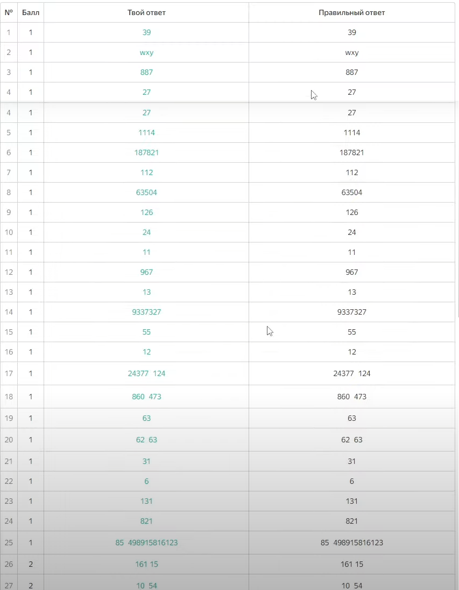
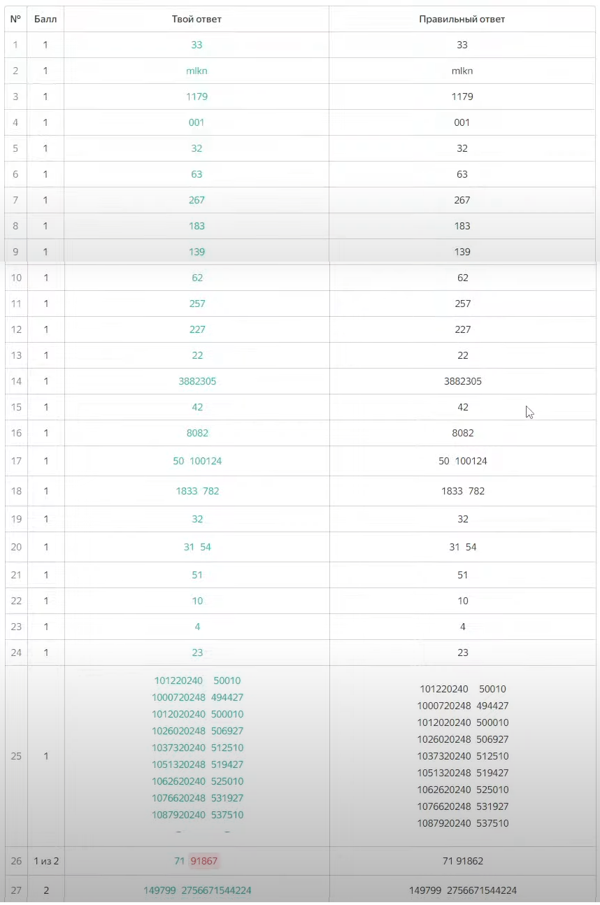

# Яндекс Варианты

* [Все варианты](https://education.yandex.ru/ege/variants)

* [Вариант 4](https://education.yandex.ru/ege/variants/7e480ec2-3b8f-4261-83ac-f01cee1cca75/task/1?start=1)

* [Вариант 5 усложненный](https://education.yandex.ru/ege/variants/7abf7990-4043-4fe4-b5ce-bcc69d714df9/task/1?start=1)

* [Пробный вариант ЕГЭ №6, похожий на досрок (апрель 2024)](https://education.yandex.ru/ege/variants/2e54e71c-dc2d-4835-9353-440269bf6ace/task/1?start=1)

